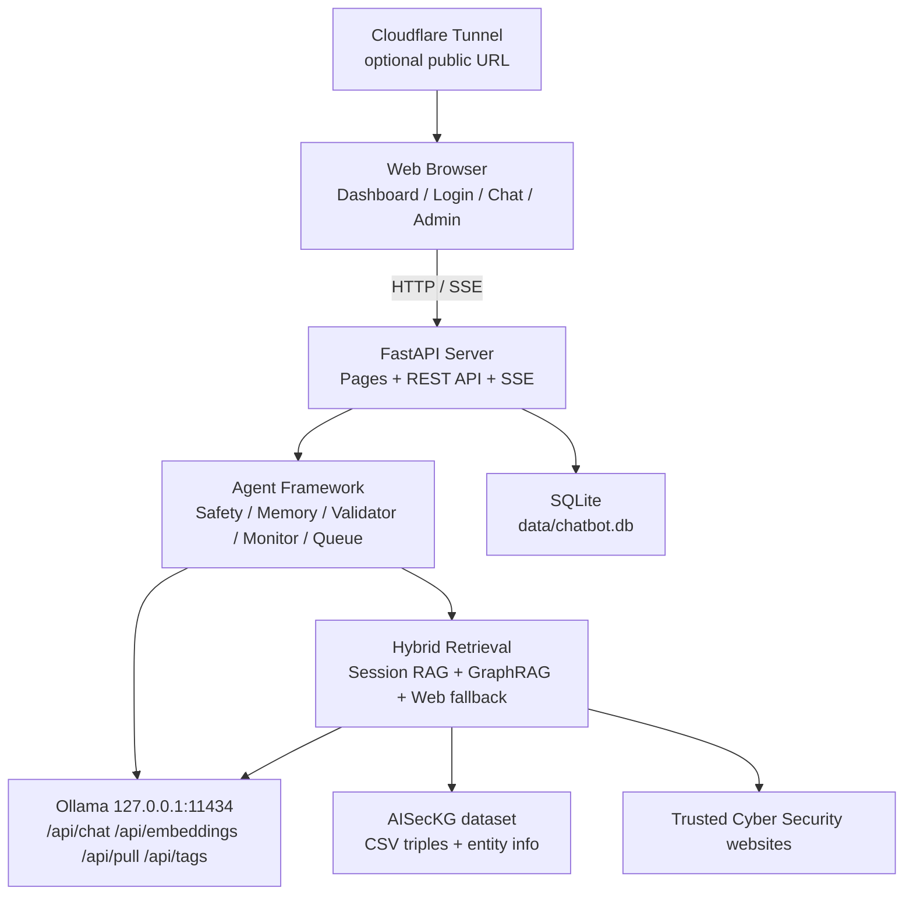
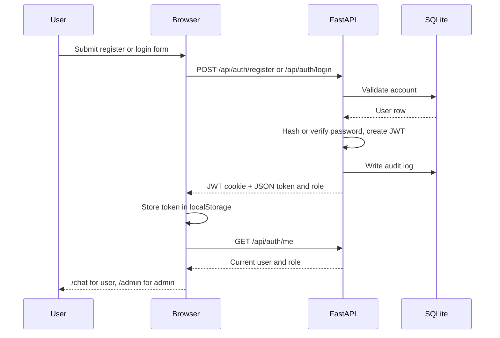
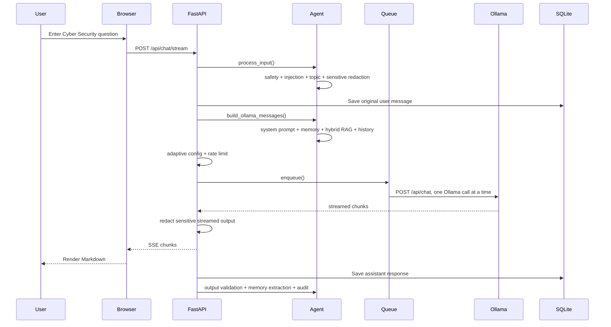
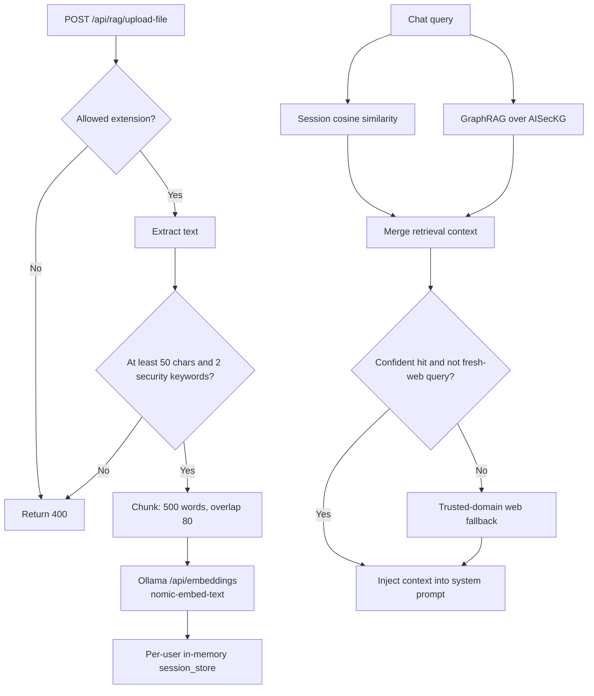
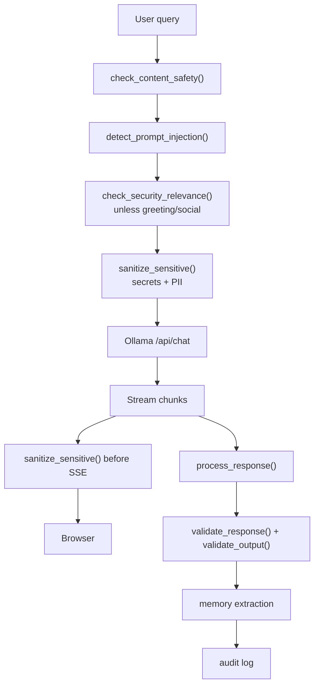
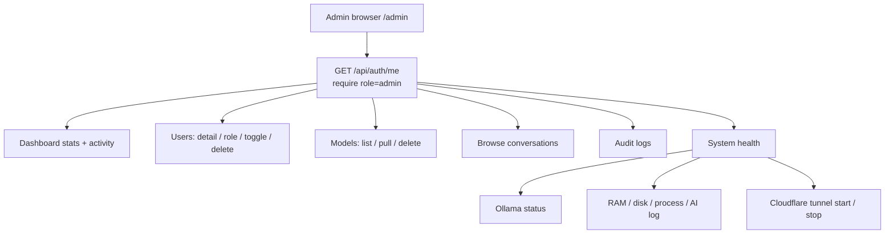
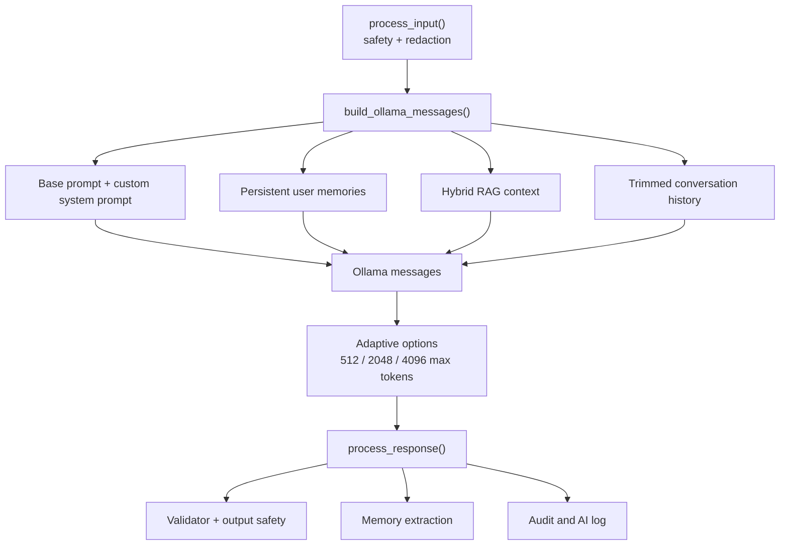
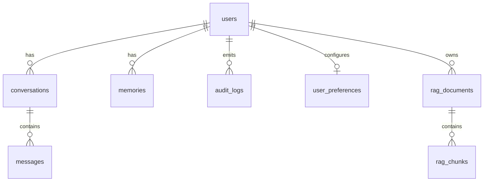

# Tysor diagrams

Các sơ đồ Mermaid dưới đây phản ánh luồng hiện tại trong mã nguồn. Bản Word sử dụng ảnh PNG tương ứng trong `docs/diagrams` để mở ổn định khi không có mạng.

## 1. System Architecture

## 2. Authentication Flow

## 3. Chat Streaming Flow

## 4. Hybrid RAG Flow

## 5. Safety And Redaction Flow

## 6. Admin Flow

## 7. Agent Framework

## 8. SQLite Schema

