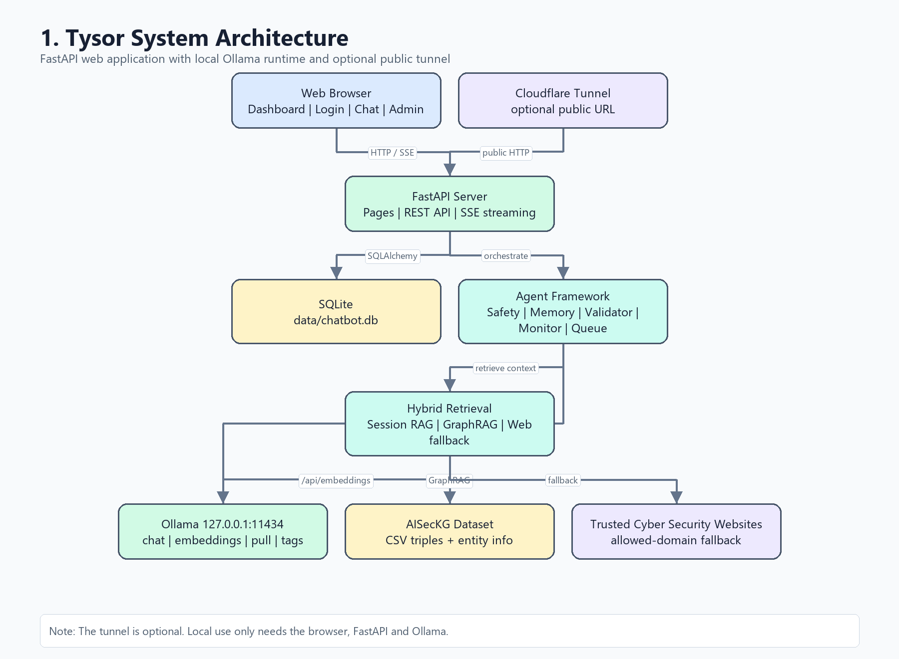
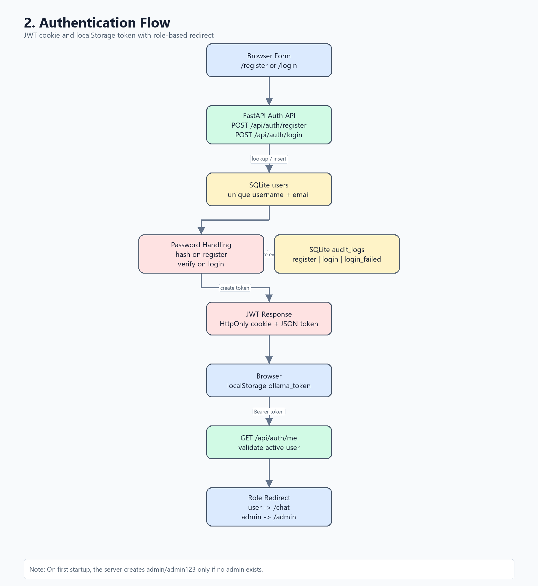
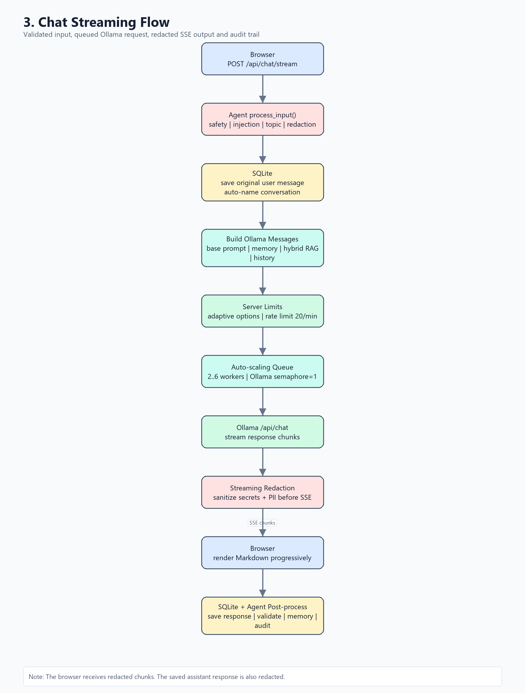
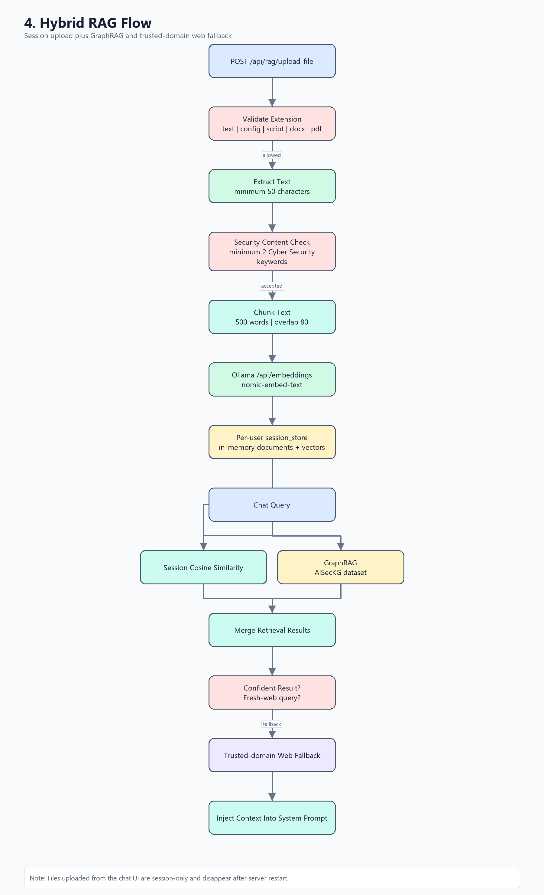
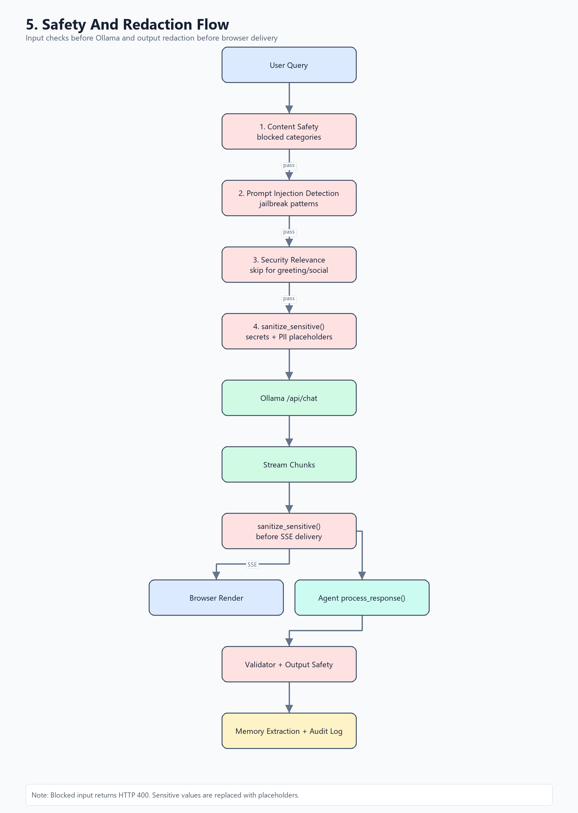
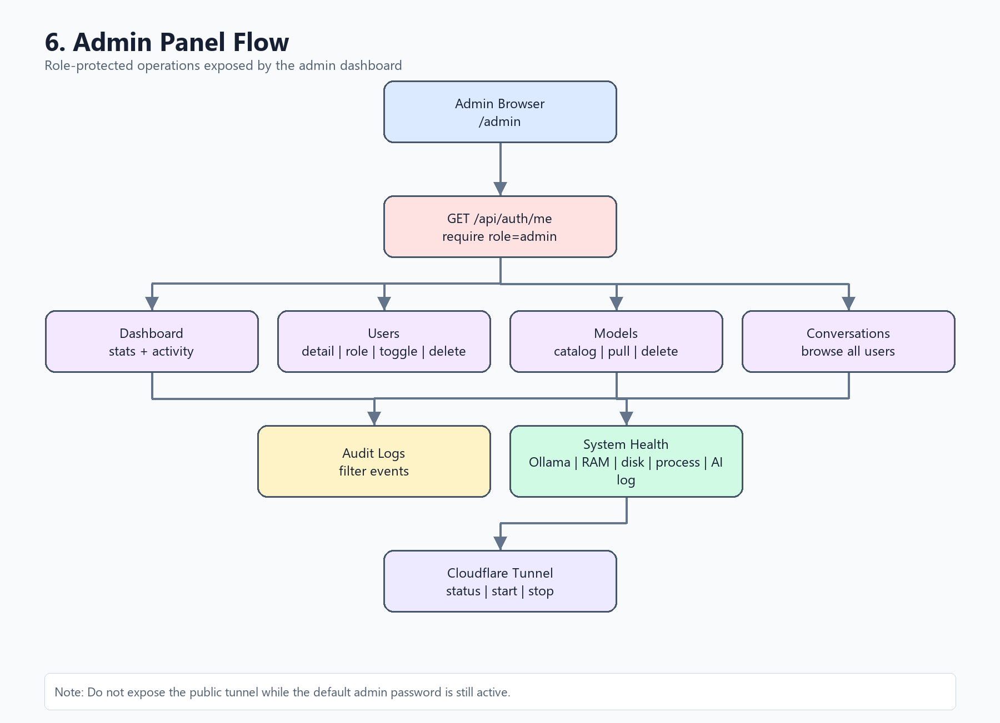
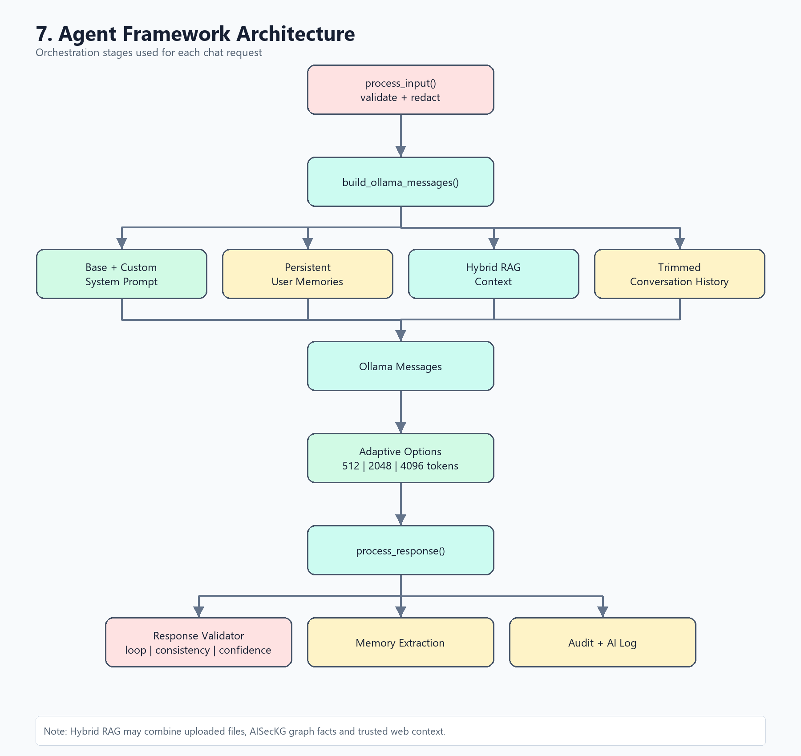
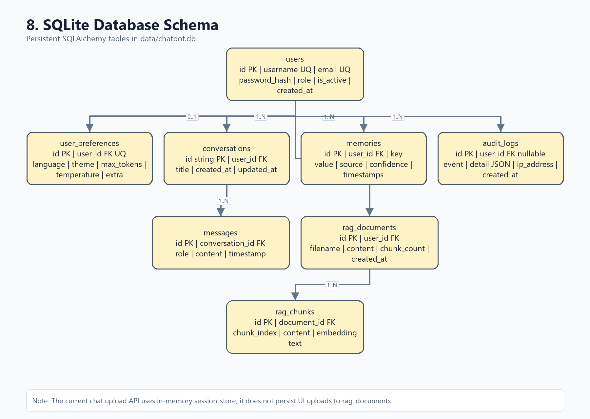

# HƯỚNG DẪN CÀI ĐẶT VÀ SỬ DỤNG TYSOR

Tài liệu này mô tả cách cài đặt, khởi chạy và sử dụng Tysor - Cyber Security AI Chatbot. Nội dung được đối chiếu với mã nguồn hiện tại của dự án.

## 1. Tổng quan

Tysor là chatbot AI chuyên về Cyber Security, chạy trên FastAPI và sử dụng Ollama làm AI runtime cục bộ. Ứng dụng có giao diện web, đăng ký và đăng nhập, phân quyền người dùng và quản trị viên, hội thoại dạng streaming, lựa chọn model, tải model từ Ollama, RAG theo phiên, GraphRAG từ bộ dữ liệu AISecKG, web fallback từ các nguồn tin cậy, memory, audit log và bộ lọc an toàn.

Các địa chỉ mặc định:

| Thành phần | Địa chỉ |
|---|---|
| Web Tysor | `http://127.0.0.1:8000` |
| Ollama API | `http://127.0.0.1:11434` |
| Trang quản trị | `http://127.0.0.1:8000/admin` |

## 2. Yêu cầu hệ thống

### 2.1. Bắt buộc

- Python `3.10+`.
- Ollama đã được cài đặt và đang chạy.
- Kết nối mạng khi cần tải model. Sau khi model đã có trên máy, chat cục bộ không bắt buộc có mạng.
- Model chat, mặc định là `qwen2:7b`.
- Model embedding `nomic-embed-text` để dùng RAG theo phiên.

### 2.2. Tùy chọn

- `cloudflared` hoặc tệp `cloudflared.exe` trong thư mục dự án nếu cần tạo URL truy cập công khai.
- Kết nối mạng nếu bật web fallback để lấy thêm ngữ cảnh Cyber Security từ các miền tin cậy.

### 2.3. Lưu ý tài nguyên

Model càng lớn càng cần nhiều RAM, VRAM và thời gian tải. Nếu máy có tài nguyên hạn chế, nên bắt đầu với model nhẹ như `qwen2.5:0.5b`, `llama3.2:1b` hoặc `llama3.2:3b`. Model mặc định của ứng dụng vẫn là `qwen2:7b`.

## 3. Cài đặt

### 3.1. Cài Ollama

1. Cài Ollama từ trang chính thức phù hợp với hệ điều hành.
2. Mở ứng dụng Ollama hoặc chạy:

```powershell
ollama serve
```

3. Kiểm tra API Ollama:

```powershell
curl http://127.0.0.1:11434/api/tags
```

Nếu Ollama hoạt động, lệnh trả về JSON chứa danh sách model đã cài.

### 3.2. Cài tự động bằng script

Từ thư mục gốc của dự án, chạy:

```powershell
py setup.py
```

Script `setup.py` thực hiện các việc sau:

- Cài thư viện Python từ `requirements.txt`.
- Kiểm tra Ollama tại `http://127.0.0.1:11434`.
- Tải `qwen2:7b` và `nomic-embed-text:latest` nếu máy chưa có.
- Kiểm tra hoặc thử cài `cloudflared`.
- Tạo thư mục `data`.

### 3.3. Cài thủ công

Có thể cài thủ công theo thứ tự:

```powershell
py -m venv .venv
.\.venv\Scripts\Activate.ps1
python -m pip install -r requirements.txt
ollama pull qwen2:7b
ollama pull nomic-embed-text
```

Nếu PowerShell chặn script kích hoạt môi trường ảo, có thể chạy Python trực tiếp từ `.venv`:

```powershell
.\.venv\Scripts\python.exe -m pip install -r requirements.txt
```

## 4. Khởi chạy ứng dụng

### 4.1. Chạy cục bộ

Đây là cách phù hợp khi chỉ dùng trên máy hiện tại:

```powershell
python -m uvicorn main:app --host 127.0.0.1 --port 8000
```

Sau đó mở:

```text
http://127.0.0.1:8000
```

### 4.2. Chạy bằng `start.bat`

Trên Windows, có thể nhấp đúp `start.bat` hoặc chạy:

```powershell
.\start.bat
```

Script sẽ:

- Khởi động Uvicorn tại `127.0.0.1:8000`.
- Kiểm tra `cloudflared`.
- Chạy `wait_for_tunnel.py` để tạo và in URL công khai dạng `trycloudflare.com`.

Chỉ dùng URL công khai khi thật sự cần chia sẻ ứng dụng. Không công khai hệ thống với mật khẩu quản trị mặc định.

### 4.3. Tài khoản quản trị ban đầu

Lần khởi động đầu tiên, ứng dụng tự tạo tài khoản quản trị nếu cơ sở dữ liệu chưa có quản trị viên:

| Vai trò | Tên đăng nhập | Mật khẩu |
|---|---|---|
| Quản trị viên | `admin` | `admin123` |

Ứng dụng hiện không có giao diện đổi mật khẩu. Tài khoản mặc định chỉ phù hợp cho demo cục bộ. Trước khi mở tunnel công khai, cần thay đổi cơ chế khởi tạo hoặc bổ sung chức năng đổi mật khẩu.

Tài khoản `testuser/test123` không được tự tạo bởi mã nguồn hiện tại. Người dùng thường cần đăng ký tại `/register`.

## 5. Đăng ký, đăng nhập và đăng xuất

### 5.1. Đăng ký người dùng

1. Mở `http://127.0.0.1:8000/register`.
2. Nhập tên đăng nhập, email và mật khẩu.
3. Chọn `Create account`.

Điều kiện:

- Tên đăng nhập có ít nhất `3` ký tự.
- Mật khẩu có ít nhất `6` ký tự.
- Tên đăng nhập và email chưa tồn tại.

Sau khi đăng ký, trình duyệt lưu JWT và chuyển đến `/chat`.

### 5.2. Đăng nhập

1. Mở `http://127.0.0.1:8000/login`.
2. Nhập tên đăng nhập và mật khẩu.
3. Chọn `Sign in`.

Người dùng thường được chuyển đến `/chat`. Quản trị viên được chuyển đến `/admin`.

### 5.3. Đăng xuất

Tại giao diện chat hoặc quản trị, chọn nút đăng xuất. Cookie xác thực bị xóa và trình duyệt quay về trang chính.

## 6. Sử dụng giao diện chat

### 6.1. Tạo và quản lý hội thoại

- Chọn `New chat` để bắt đầu hội thoại mới.
- Nhập câu hỏi Cyber Security vào ô chat và chọn nút gửi.
- Phản hồi được hiển thị dần theo SSE streaming.
- Chọn nút dừng để ngừng nhận phản hồi trên trình duyệt.
- Danh sách bên trái chứa các hội thoại đã lưu.
- Tiêu đề hội thoại được tạo tự động từ tin nhắn đầu tiên.
- Dùng nút trước và sau ở thanh đầu trang để chuyển giữa các hội thoại.
- Chọn dấu xóa bên cạnh hội thoại và xác nhận để xóa.

### 6.2. Phạm vi câu hỏi

Tysor ưu tiên câu hỏi về bảo mật, an ninh mạng, mã hóa, phân tích lỗ hổng, CVE, phòng thủ, kiểm thử bảo mật và các chủ đề liên quan. Câu hỏi ngoài phạm vi có thể bị từ chối. Lời chào và tương tác xã hội ngắn được phép đi qua bộ lọc chủ đề.

Ví dụ phù hợp:

```text
Giải thích cách giảm rủi ro SQL injection trong API FastAPI.
```

```text
Phân tích CVE-2024-XXXX theo góc nhìn phòng thủ.
```

### 6.3. Chuyển giao diện sáng và tối

Chọn `Dark mode` hoặc `Light mode` ở thanh bên. Lựa chọn được lưu trong trình duyệt.

## 7. Model và thiết lập sinh nội dung

Mở `Settings` ở thanh bên để thay đổi:

| Thiết lập | Giá trị giao diện mặc định | Ý nghĩa |
|---|---:|---|
| Model | `qwen2:7b` | Model Ollama dùng để chat |
| System prompt | Prompt chuyên gia Cyber Security | Chỉ dẫn bổ sung cho model |
| Temperature | `0.7` | Mức ngẫu nhiên của câu trả lời |
| Max tokens | `2048` | Giới hạn phản hồi do người dùng yêu cầu |
| Top-P | `0.9` | Lấy mẫu nucleus |
| Top-K | `40` | Số token ứng viên |

Danh sách model chia theo nhóm General, Lightweight, Code, Vision, Embedding, Math và Creative. Khi chọn model chưa cài, giao diện gọi Ollama để tải model. Quá trình này có thể mất thời gian tùy kích thước model và tốc độ mạng.

Ứng dụng còn áp dụng giới hạn thích nghi:

| Độ dài câu hỏi | Giới hạn thích nghi |
|---|---:|
| Tối đa `10` từ | `512` tokens |
| Từ `11` đến `49` từ | `2048` tokens |
| Từ `50` từ trở lên | `4096` tokens |

Giới hạn thực tế là giá trị nhỏ hơn giữa yêu cầu từ giao diện, giới hạn thích nghi và hard limit máy chủ.

## 8. Tải tài liệu RAG theo phiên

### 8.1. Cách tải tài liệu

1. Tại trang chat, chọn biểu tượng tài liệu cạnh nút gửi.
2. Kéo thả tệp hoặc chọn vùng tải tệp.
3. Chờ trạng thái xử lý hoàn tất.
4. Đặt câu hỏi liên quan đến nội dung vừa tải.

### 8.2. Định dạng hỗ trợ

| Nhóm | Phần mở rộng |
|---|---|
| Văn bản và cấu hình | `.txt`, `.md`, `.csv`, `.log`, `.json`, `.yaml`, `.yml`, `.conf`, `.cfg`, `.ini`, `.xml` |
| Script và mã nguồn | `.ps1`, `.sh`, `.py`, `.bat` |
| Tài liệu | `.docx`, `.pdf` |

### 8.3. Điều kiện chấp nhận

- Nội dung sau khi trích xuất có ít nhất `50` ký tự.
- Nội dung có ít nhất `2` từ khóa Cyber Security.
- Model embedding `nomic-embed-text` hoạt động trong Ollama.

### 8.4. Cách RAG hoạt động

- Tài liệu được tách thành đoạn `500` từ, chồng lấn `80` từ.
- Ollama tạo embedding qua `/api/embeddings`.
- Các đoạn và embedding được giữ trong bộ nhớ của tiến trình theo từng người dùng.
- Khi chat, hệ thống lấy các đoạn gần nhất theo cosine similarity.
- GraphRAG tra cứu thêm từ bộ dữ liệu `AISecKG-cybersecurity-dataset`.
- Nếu chưa có kết quả đủ tin cậy hoặc câu hỏi cần thông tin mới, web fallback có thể lấy ngữ cảnh từ các miền Cyber Security được cho phép.

Tài liệu tải từ giao diện là session-only: dữ liệu mất khi máy chủ khởi động lại. Danh sách tệp cũng cho phép xóa thủ công từng tài liệu.

## 9. Bộ lọc an toàn và bảo vệ dữ liệu

Trước khi gửi câu hỏi đến Ollama, ứng dụng lần lượt:

1. Kiểm tra nhóm nội dung bị chặn.
2. Phát hiện prompt injection và jailbreak phổ biến.
3. Kiểm tra câu hỏi có liên quan Cyber Security hay không, trừ lời chào và tương tác xã hội ngắn.
4. Thay thế dữ liệu nhạy cảm bằng placeholder.

Dữ liệu có thể bị che gồm:

- Email, số điện thoại và CCCD.
- API key, GitHub token, AWS access key, Google API key, Slack token.
- Private key, JWT và chuỗi gán vào các trường như `password`, `secret` hoặc `token`.

Khi Ollama streaming phản hồi, ứng dụng tiếp tục che dữ liệu nhạy cảm trước khi gửi nội dung ra trình duyệt. Sau phản hồi, hệ thống chạy output validation, safety check, memory extraction và audit log.

## 10. Quản trị hệ thống

Đăng nhập bằng tài khoản có vai trò `admin`, sau đó mở `/admin`.

| Khu vực | Chức năng |
|---|---|
| Dashboard | Thống kê users, conversations, messages, tokens, cost ước tính, max tokens và dung lượng SQLite |
| Activity | Theo dõi hoạt động gần đây |
| Users | Xem chi tiết, đổi vai trò, bật hoặc tắt tài khoản, xóa tài khoản |
| Models | Xem model Ollama, tải model và xóa model |
| Conversations | Duyệt hội thoại theo người dùng |
| Audit Logs | Xem nhật ký đăng nhập, đăng ký, chat, safety và thao tác admin |
| System | Xem trạng thái Ollama, RAM, disk, Python, process, AI log và Cloudflare tunnel |

Trong khu vực `System`, quản trị viên có thể chọn `Start Tunnel` hoặc `Stop Tunnel`. Tunnel tạo URL công khai, vì vậy cần kiểm tra tài khoản và dữ liệu trước khi bật.

## 11. Dữ liệu, giới hạn và biến môi trường

### 11.1. Dữ liệu lưu bền vững

Cơ sở dữ liệu mặc định là SQLite:

```text
data/chatbot.db
```

SQLite lưu người dùng, hội thoại, tin nhắn, memory, audit log, tùy chọn và schema RAG lưu bền vững. Tuy nhiên, API tải tệp trên giao diện hiện dùng session store trong bộ nhớ, không ghi các tệp tải từ giao diện vào bảng RAG SQLite.

### 11.2. Giới hạn mặc định

| Thông số | Giá trị |
|---|---:|
| Rate limit chat | `20` yêu cầu / `60` giây / người dùng |
| Worker queue | Tối thiểu `2`, tối đa `6` worker |
| Số request Ollama chạy đồng thời | `1` |
| Lịch sử gần nhất xem xét | `50` tin nhắn |
| Context budget | `4096` tokens xấp xỉ |
| Hard max response | `8192` tokens mặc định |

### 11.3. Biến môi trường đáng chú ý

| Biến | Mặc định | Mục đích |
|---|---|---|
| `DATABASE_URL` | `sqlite:///./data/chatbot.db` | Kết nối cơ sở dữ liệu |
| `DEFAULT_MAX_TOKENS` | `2048` | Max tokens mặc định |
| `MAX_RESPONSE_TOKENS` | `8192` | Hard limit phản hồi |
| `GRAPHRAG_ENABLED` | `1` | Bật hoặc tắt GraphRAG |
| `GRAPHRAG_DATASET_DIR` | Dataset trong dự án | Đường dẫn dataset GraphRAG |
| `WEB_FETCH_ENABLED` | `1` | Bật hoặc tắt web fallback |
| `WEB_FETCH_ALLOWED_DOMAINS` | Danh sách miền tin cậy có sẵn | Ghi đè whitelist web |
| `WEB_FETCH_TIMEOUT` | `8` | Timeout truy xuất web |

## 12. Xử lý lỗi thường gặp

### 12.1. Không kết nối được Ollama

Biểu hiện: chat báo không thể kết nối Ollama hoặc danh sách model rỗng.

Kiểm tra:

```powershell
ollama serve
curl http://127.0.0.1:11434/api/tags
```

### 12.2. Model chưa có

Tải model cần thiết:

```powershell
ollama pull qwen2:7b
ollama pull nomic-embed-text
```

### 12.3. RAG không nhận tệp

Kiểm tra:

- Phần mở rộng nằm trong danh sách hỗ trợ.
- Tệp có nội dung đọc được.
- Nội dung có ít nhất `50` ký tự và ít nhất `2` từ khóa Cyber Security.
- `nomic-embed-text` đã được cài trong Ollama.

### 12.4. Không tạo được tunnel

Kiểm tra:

```powershell
cloudflared --version
```

Nếu không dùng tunnel, chạy Uvicorn trực tiếp như mục 4.1.

### 12.5. Bị từ chối câu hỏi

Đặt câu hỏi theo ngữ cảnh Cyber Security rõ ràng. Bộ lọc có thể chặn câu hỏi ngoài chủ đề, prompt injection hoặc yêu cầu thuộc nhóm nội dung nguy hiểm.

## 13. API tham khảo

### 13.1. Trang web

| Method | Path | Xác thực | Mô tả |
|---|---|---|---|
| `GET` | `/` | Tùy chọn | Landing page hoặc chuyển hướng theo vai trò |
| `GET` | `/chat` | User | Giao diện chat |
| `GET` | `/login` | Không | Đăng nhập |
| `GET` | `/register` | Không | Đăng ký |
| `GET` | `/admin` | Admin | Giao diện quản trị |

### 13.2. Xác thực và hội thoại

| Method | Path | Xác thực | Mô tả |
|---|---|---|---|
| `POST` | `/api/auth/register` | Không | Tạo tài khoản |
| `POST` | `/api/auth/login` | Không | Đăng nhập |
| `GET` | `/api/auth/me` | User | Thông tin người dùng hiện tại |
| `POST` | `/api/auth/logout` | Không | Xóa cookie xác thực |
| `POST` | `/api/chat/stream` | User | Chat dạng SSE streaming |
| `GET` | `/api/conversations` | User | Danh sách hội thoại |
| `GET` | `/api/conversations/{conv_id}` | User | Nội dung hội thoại |
| `PUT` | `/api/conversations/{conv_id}` | User | Đổi tiêu đề |
| `DELETE` | `/api/conversations/{conv_id}` | User | Xóa hội thoại |

### 13.3. Memory, RAG và model

| Method | Path | Xác thực | Mô tả |
|---|---|---|---|
| `GET` | `/api/memories` | User | Danh sách memory |
| `POST` | `/api/memories` | User | Thêm hoặc cập nhật memory |
| `DELETE` | `/api/memories/{key}` | User | Xóa memory |
| `POST` | `/api/rag/upload-file` | User | Tải tệp RAG theo phiên |
| `GET` | `/api/rag/documents` | User | Danh sách tệp RAG theo phiên |
| `DELETE` | `/api/rag/documents/{doc_id}` | User | Xóa tệp RAG theo phiên |
| `GET` | `/api/rag/search?q=...` | User | Kiểm tra truy xuất hybrid RAG |
| `GET` | `/api/rag/graph/status` | User | Trạng thái GraphRAG |
| `GET` | `/api/models` | Không | Danh sách model Ollama đã cài |
| `GET` | `/api/models/catalog` | Không | Catalog model và trạng thái cài |
| `POST` | `/api/models/pull` | User | Tải model Ollama |

### 13.4. Quản trị

| Method | Path | Xác thực | Mô tả |
|---|---|---|---|
| `GET` | `/api/admin/stats` | Admin | Thống kê dashboard |
| `GET` | `/api/admin/users` | Admin | Danh sách người dùng |
| `GET` | `/api/admin/users/{user_id}` | Admin | Chi tiết người dùng |
| `PUT` | `/api/admin/users/{user_id}/role` | Admin | Đổi vai trò |
| `PUT` | `/api/admin/users/{user_id}/toggle` | Admin | Bật hoặc tắt tài khoản |
| `DELETE` | `/api/admin/users/{user_id}` | Admin | Xóa tài khoản |
| `GET` | `/api/admin/activity` | Admin | Activity feed |
| `GET` | `/api/admin/audit` | Admin | Audit logs |
| `GET` | `/api/admin/conversations` | Admin | Danh sách hội thoại toàn hệ thống |
| `DELETE` | `/api/admin/models/{model_name}` | Admin | Xóa model Ollama |
| `GET` | `/api/admin/system` | Admin | Tình trạng hệ thống |
| `GET` | `/api/admin/tunnel` | Admin | Trạng thái tunnel |
| `POST` | `/api/admin/tunnel/start` | Admin | Bật tunnel |
| `POST` | `/api/admin/tunnel/stop` | Admin | Tắt tunnel |

## 14. Diagram hệ thống

Các diagram dưới đây đã được chuyển thành ảnh PNG để nhúng trực tiếp vào bản Word.

### 14.1. Kiến trúc tổng thể



### 14.2. Luồng xác thực



### 14.3. Luồng chat streaming



### 14.4. Luồng Hybrid RAG



### 14.5. Luồng safety và redaction



### 14.6. Luồng quản trị



### 14.7. Kiến trúc Agent Framework



### 14.8. Schema SQLite



## 15. Kết luận vận hành

Để chạy demo cục bộ ổn định:

1. Bật Ollama.
2. Đảm bảo có `qwen2:7b` và `nomic-embed-text`.
3. Chạy Uvicorn tại `127.0.0.1:8000`.
4. Đăng ký tài khoản người dùng hoặc đăng nhập quản trị.
5. Chỉ bật Cloudflare tunnel sau khi đã xử lý mật khẩu quản trị mặc định và rà soát dữ liệu.
